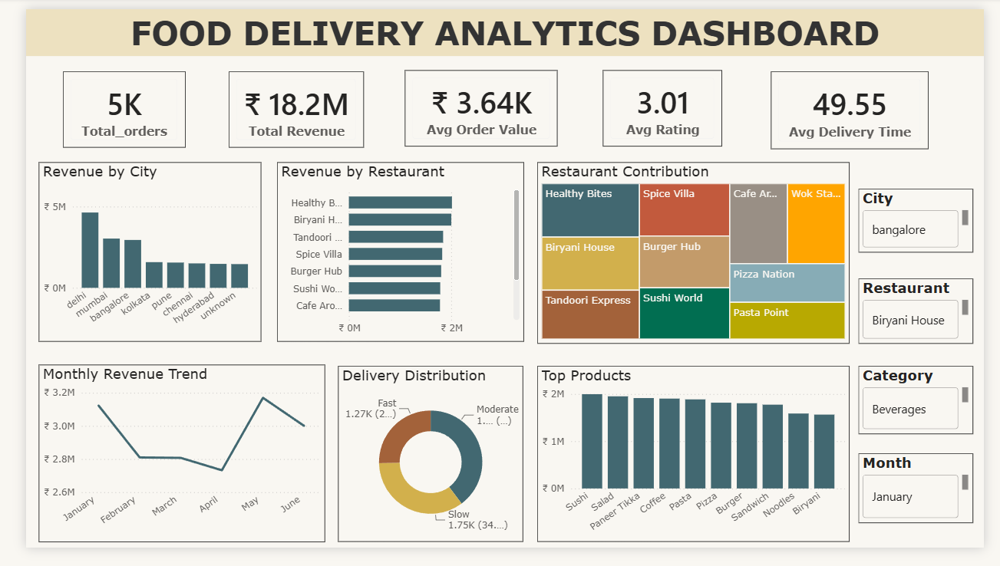

# 📊 Food Delivery Analytics Dashboard (Power BI)

This module presents an interactive **Power BI dashboard** built on the cleaned food delivery dataset.

The dashboard transforms SQL reporting data into executive-level visualizations, enabling stakeholders to monitor sales performance, customer satisfaction, restaurant operations, and delivery efficiency through dynamic filtering.

> **Note:** Data preparation and business analysis were performed in the SQL module. This README focuses only on the Power BI implementation.

---

# 📌 Dashboard Workflow

```text
SQLite Database
       │
       ▼
ODBC Connection
       │
       ▼
Power Query
       │
       ▼
Data Modeling
       │
       ▼
DAX Measures
       │
       ▼
Interactive Dashboard
```

---

# 📂 Files

| File | Description |
|------|-------------|
| `Food Delivery Dashboard.pbix` | Power BI report |
| `README.md` | Dashboard documentation |
| `dashboard.png` | Dashboard preview *(optional)* |

---

# 🔗 Data Source

The dashboard connects directly to the **SQLite database** through **ODBC**.

Data is imported from the cleaned SQL table:

```
clean_orders
```

Using the cleaned dataset ensures all visualizations are built on validated and standardized data.

---

# 📊 Dashboard Components

## Executive KPIs

The dashboard includes five key performance indicators:

- Total Orders
- Total Revenue
- Average Order Value
- Average Customer Rating
- Average Delivery Time

These KPIs automatically update based on user selections.

---

## Business Visualizations

### Revenue by City

Compares total revenue generated across cities.

**Business Use**

- Identify high-performing markets
- Support expansion decisions

---

### Revenue by Restaurant

Ranks restaurants based on revenue contribution.

**Business Use**

- Identify top-performing restaurant partners
- Monitor sales performance

---

### Restaurant Contribution

Treemap visualization showing each restaurant's share of total revenue.

**Business Use**

- Understand revenue concentration
- Identify key business contributors

---

### Monthly Revenue Trend

Displays revenue performance over time.

**Business Use**

- Monitor growth trends
- Detect seasonal patterns

---

### Delivery Distribution

Visualizes the proportion of deliveries across delivery time ranges.

**Business Use**

- Monitor operational efficiency
- Identify service bottlenecks

---

### Top Products

Highlights the highest revenue-generating food items.

**Business Use**

- Menu optimization
- Promotion planning

---

# 🎛️ Interactive Filters

The dashboard supports dynamic filtering using slicers.

Available filters include:

- City
- Restaurant
- Category
- Month

All KPIs and visualizations respond instantly to slicer selections.

---

# 📈 DAX Measures

Custom DAX measures were created to calculate key business metrics, including:

- Total Revenue
- Average Order Value
- Average Rating
- Average Delivery Time

These measures provide consistent calculations across all report visuals.

---

# 💡 Key Business Insights

The dashboard reveals several important insights, including:

- Delhi generated the highest overall revenue.
- Healthy Bites contributed the largest share of restaurant revenue.
- Sushi was the highest revenue-generating food item.
- Fast Food and Indian cuisines generated the largest revenue share.
- Most deliveries were completed within 30–60 minutes.
- Revenue increased from April to May before declining slightly in June.

---

# 🛠️ Tools Used

- Power BI Desktop
- Power Query
- DAX
- SQLite
- ODBC

---

# 📷 Dashboard Preview



---

# 🚀 Learning Outcomes

This dashboard demonstrates practical experience with:

- Dashboard Design
- KPI Development
- Data Modeling
- DAX Measures
- Interactive Reporting
- Business Storytelling
- Data Visualization
- Executive Reporting

---

# 👩‍💻 Author

**Simran**

Built as part of an end-to-end Data Analytics project to demonstrate business reporting and dashboard development using **Power BI**.
