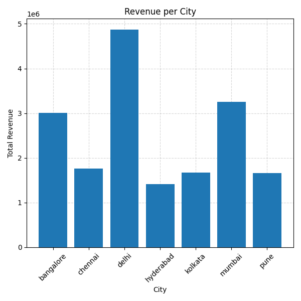
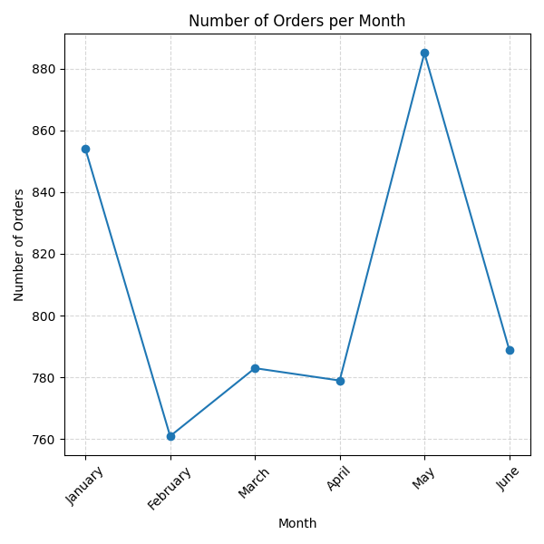
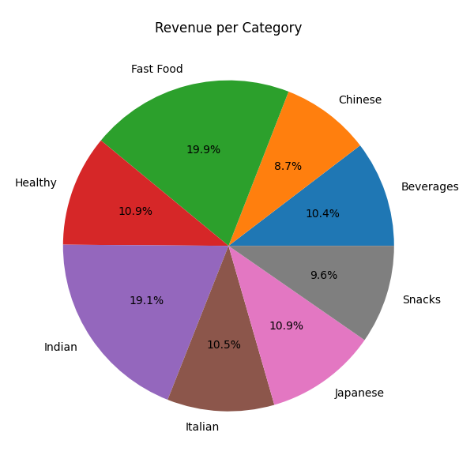

# 🍔 Food Delivery Analytics Project (Python)

An end-to-end Data Analytics project built using Python to simulate a real-world food delivery business workflow.

This project focuses heavily on:
- cleaning messy raw data,
- performing business-oriented exploratory data analysis (EDA),
- generating operational and customer insights,
- and building realistic preprocessing workflows.

The project was intentionally built using a small but highly inconsistent dataset for learning purposes.

---

# 📌 Project Workflow

```text
Raw Dataset
      ↓
Data Cleaning & Validation
      ↓
Feature Engineering
      ↓
Exploratory Data Analysis
      ↓
Business Insights & Visualizations
```

---

# 📌 About the Dataset

The dataset used in this project is intentionally small but raw and messy.

The focus of this project was not building a production-scale system, but understanding:
- real-world preprocessing challenges,
- business-aware data cleaning,
- analytical thinking,
- and workflow design.

The raw dataset contained:
- missing values,
- invalid numeric values,
- duplicate records,
- inconsistent text formatting,
- noisy categorical data,
- and mixed data types.

---

# 📂 Project Structure

| File | Purpose |
|------|------|
| `cleaning.py` | Cleans and preprocesses raw food delivery data |
| `analysis.py` | Performs exploratory analysis and business analytics |
| `food_delivery_raw_messy_dataset.csv` | Original raw dataset |
| `cleaned_food_delivery.csv` | Final cleaned dataset |
| `images/` | Saved visualizations generated during analysis |

---

# 🏗️ Phase 1 — Data Cleaning (`cleaning.py`)

The first phase focused on transforming inconsistent raw delivery data into a clean and analysis-ready dataset.

---

# ✅ Cleaning Performed

## 1. Duplicate Removal

Removed duplicate orders using:

```python
drop_duplicates(subset='Order_ID')
```

to ensure each order remained unique.

---

## 2. City Cleaning & Recovery

- Standardized city names using lowercase formatting.
- Missing city values were recovered using restaurant-level mode imputation.

### Logic Used:
If a restaurant commonly belongs to one city, missing city values can often be logically inferred from that restaurant.

---

## 3. Date Handling (Important Decision)

Dates were converted into proper datetime format using:

```python
pd.to_datetime()
```

Initially, date imputation was attempted using grouped mode values.

However, this approach was later intentionally removed.

### Reason:
Imputing dates can create fake historical events and distort:
- trend analysis,
- seasonality,
- forecasting,
- and operational insights.

Instead of creating artificial timestamps, a new column was created:

```python
Date_Flag
```

to mark rows where dates were originally missing.

### Important Learning:
> In real-world analytics, fake data is often worse than missing data.

This became one of the most important design decisions in the project.

---

## 4. Feature Engineering

Additional columns created:
- Day
- Month
- Month_Name
- Revenue

Revenue was calculated as:

```python
Revenue = Price × Quantity
```

---

## 5. Multi-Level Fallback Strategy (Key Part)

One of the strongest preprocessing techniques used in this project was hierarchical, group-based imputation.

Instead of using global averages, missing values were filled contextually.

### Example:
For Price and Quantity:

### First fallback:
```text
Restaurant + Food_Item + City
```

### Second fallback:
```text
Food_Item + City
```

This helped preserve realistic business patterns while minimizing distortion.

---

## 6. Quantity Cleaning

The dataset contained text quantities such as:

```text
"three"
```

Instead of discarding them, they were mapped into numeric values:

```python
'three' → 3
```

This preserved valid business information instead of losing data unnecessarily.

---

## 7. Delivery Time Validation

- Invalid delivery times (≤ 0) were treated as missing.
- Missing delivery times were recovered using grouped restaurant-city averages.

---

## 8. Customer Rating Validation

Customer ratings outside valid business ranges:
- below 0
- above 5

were treated as invalid and corrected using restaurant-level average ratings.

---

## 9. Payment Method Standardization

Payment methods were cleaned using:
- lowercase conversion
- whitespace stripping

to ensure categorical consistency.

---

# 📊 Phase 2 — Business Analytics (`analysis.py`)

The second phase focused on extracting meaningful operational and customer insights from the cleaned dataset. 

This phase moved beyond simple plotting and focused on asking business-oriented analytical questions.

---

# 📈 Restaurant Analytics

## ✅ Top Restaurants by Revenue

Identified restaurants generating the highest revenue.

### Business Insight:
Helps identify high-performing restaurants and strong market demand.

---

## ✅ Highest Rated Restaurants

Customer ratings were analyzed using:

```python
mean()
```

instead of:
```python
sum()
```

because ratings represent averages, not cumulative values.

This was an important analytical correction during the project.

---

## ✅ Average Delivery Time per Restaurant

Compared delivery efficiency across restaurants to identify operational performance differences.

### Visualization:
- Bar Chart

---

# 🚚 Operational Analytics

## ✅ Peak Order Months

Monthly order patterns were analyzed after excluding rows with unreliable dates (`Date_Flag = True`).

### Business Insight:
Helps identify high-demand periods for:
- promotions,
- staffing,
- and inventory planning.

### Visualization:
- Line Chart

---

## ✅ Fastest Delivery Cities

Compared average delivery time across cities.

### Business Insight:
Helps identify cities with more operationally efficient delivery systems.

---

## ✅ Payment Method Usage

Analyzed customer payment preferences using `value_counts()`.

### Business Insight:
Supports checkout optimization and payment infrastructure decisions.

### Visualization:
- Pie Chart

---

# 😊 Customer Experience Analytics

## ✅ Rating vs Delivery Speed

Initially, customer ratings were grouped by exact delivery minutes.

Later, this approach was improved using:
```python
pd.cut()
```

to create meaningful delivery speed categories:
- Fast
- Moderate
- Slow
- Very Slow

This process is called:
# Binning / Bucketing

### Why This Was Important:
Grouping by exact minutes creates many tiny groups that are statistically weak and difficult to interpret.

Using delivery speed categories produced:
- cleaner insights,
- more meaningful averages,
- and more business-friendly analysis.

### Business Insight:
Faster deliveries generally showed higher average customer ratings.

---

## ✅ Rating vs City

Compared customer satisfaction levels across cities.

### Business Insight:
Helps identify cities requiring operational or customer experience improvements.

---

# 💰 Revenue Analytics

## ✅ Revenue per Category

Compared category-wise revenue contribution.

### Visualization:
- Pie Chart

---

## ✅ Revenue per City

Analyzed revenue distribution across cities.

### Business Insight:
Helps identify high-performing expansion markets.

---

## ✅ Revenue per Restaurant

Compared restaurant-level revenue performance.

### Business Insight:
High-performing restaurants may further benefit from:
- menu optimization,
- stronger promotions,
- or operational scaling.

---

# 📷 Visualizations Generated

The project generates and saves multiple charts automatically into the `images/` folder.

Examples include:
- Revenue per City
- Revenue per Category
- Payment Method Usage
- Average Delivery Time per Restaurant
- Customer Rating vs Delivery Speed
- Number of Orders per Month

# 📸 Sample Visualizations

## Revenue per City


## Number of orders per Month


## Revenue per Category


---

# 🧠 Key Concepts Demonstrated

## Data Engineering
- Data Cleaning
- Missing Value Handling
- Group-Based Imputation
- Hierarchical Fallback Strategy
- Feature Engineering
- Data Validation

## Data Analysis
- Exploratory Data Analysis (EDA)
- Business Analytics
- Operational Analytics
- Customer Experience Analysis
- Revenue Analysis

## Visualization
- Bar Charts
- Pie Charts
- Line Charts
- Data Interpretation

---

# 🛠️ Technologies Used

- Python
- Pandas
- NumPy
- Matplotlib

---

# 🚀 Key Learning Outcomes

This project helped build understanding of:
- real-world messy data handling,
- why contextual imputation matters,
- why analytical correctness is more important than just technical correctness,
- and how meaningful business questions improve analysis quality.

One of the biggest lessons learned was:
> Missing data should not always be forcefully filled.

In several cases, preserving trustworthy data was more important than achieving 100% non-null datasets.

---

# 👩‍💻 Author

Simran

This project was built as a hands-on learning project to understand realistic data cleaning workflows and business-oriented analytics using Python.
